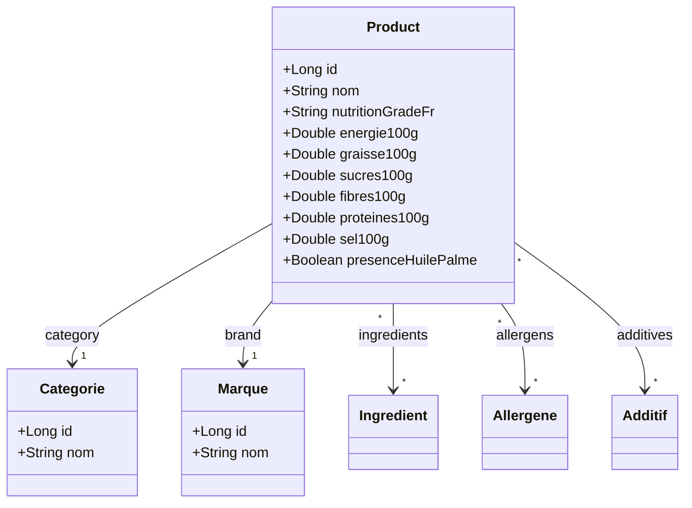

# etl-off 🥖🥗 (Open Food Facts ETL & REST API)

`etl-off` est une application backend développée en **Spring Boot 3** et **Java 21** (utilisant les **Virtual Threads / Project Loom**). Elle permet d'extraire, nettoyer, structurer et exposer les données de la base de données publique **Open Food Facts** à travers une API REST performante.

Ce projet a été réalisé par **Marius BOURSE** dans le cadre du cursus de Master 2 de développement.

---

## 🚀 Fonctionnalités Clés

- **Ingestion Haute Performance** : Traitement parallèle des données à l'aide des *Virtual Threads* Java 21 pour maximiser le débit d'insertion des produits.
- **Nettoyage Avancé des Données** :
  - Parsing et découpage robuste des listes d'ingrédients, d'allergènes et d'additifs.
  - Nettoyage des caractères spéciaux parasites (ex. : `*`, `_`, etc.).
  - Élimination automatique des pourcentages (ex. : `Sucre 15%` -> `Sucre`) et des descriptions entre parenthèses (ex. : `Farine (Blé)` -> `Farine`).
  - Filtres sémantiques intelligents pour exclure les phrases descriptives ou d'avertissement.
- **Modèle de Données Normalisé** : Modèle relationnel relation-association persistant proprement les produits, catégories, marques, ingrédients, allergènes et additifs avec contraintes d'unicité.
- **Mise en Cache** : Optimisation des temps d'accès grâce au cache de Spring Cache.
- **API REST Riches** : Endpoints performants permettant de chercher les produits par catégorie, marque, et obtenir le top des ingrédients, allergènes et additifs les plus récurrents.

---

## 🛠️ Stack Technique

* **Framework principal** : [Spring Boot 3.3.1](https://spring.io/projects/spring-boot)
  * Spring Data JPA (Persistance relationnelle)
  * Spring Web (Exposition des APIs REST)
  * Spring Cache (Optimisation des performances)
* **Langage** : Java 21 (Virtual Threads activés : `spring.threads.virtual.enabled=true`)
* **Base de données** : [H2 Database](https://www.h2database.com/) (Base de données relationnelle en mémoire)
* **Librairie de productivité** : [Lombok](https://projectlombok.org/) (Réduction du code boilerplate)
* **Gestionnaire de dépendances** : Maven

---

## 📐 Conception & Modélisation

Tous les éléments de conception se trouvent dans le répertoire [conception](file:///c:/Users/MARIU/Documents/Cours%20M2%20dev/etl-off/conception) à la racine du projet.

Pour une description complète des choix de conception et pour visualiser les diagrammes interactifs :
* [Consulter la documentation de conception](file:///c:/Users/MARIU/Documents/Cours%20M2%20dev/etl-off/conception/README.md)

### Extrait du Diagramme de Classes Métier (UML)


---

## ⚡ Traitement ETL & Optimisations

Lors du lancement de l'application, `EtlRunner` déclenche automatiquement l'ingestion du fichier `open-food-facts.csv`. Plusieurs techniques sont combinées pour accélérer le traitement :

1. **Extraction Unique Préalable (Pre-parsing)** : Les catégories, marques, ingrédients, allergènes et additifs uniques sont d'abord extraits, nettoyés, et insérés en bloc en base de données.
2. **Index en Mémoire (Caches applicatifs)** : Les entités de référence (catégories, marques, etc.) sont chargées dans des `ConcurrentHashMap` en mémoire pour permettre des résolutions en $O(1)$ lors de la création des relations des produits, limitant ainsi les appels à la base de données.
3. **JDBC Batching** : Configuration de Hibernate pour effectuer des insertions groupées (batchs de 500) au lieu de requêtes individuelles.
4. **Virtual Threads** : Utilisation d'un `ExecutorService` de type *VirtualThreadPerTaskExecutor* pour paralléliser l'ingestion par paquets de lignes de façon hautement scalable.

---

## 🔌 API REST Endpoints

L'application expose les points d'accès HTTP suivants sur le port par défaut (`8080`) :

### Produits
* **`GET /products/top-by-brand`**
  * *Description* : Retourne le top $N$ des produits d'une marque, ordonnés par score nutritionnel (Nutri-Score décroissant, de A à F).
  * *Paramètres* : `brand` (Nom de la marque, ex: *Danone*), `limit` (Facultatif, défaut: 10)
* **`GET /products/top-by-category`**
  * *Description* : Retourne le top $N$ des produits d'une catégorie.
  * *Paramètres* : `category` (Nom de la catégorie, ex: *Sodas*), `limit` (Facultatif, défaut: 10)
* **`GET /products/top-by-brand-category`**
  * *Description* : Retourne le top $N$ des produits combinant une marque et une catégorie.
  * *Paramètres* : `brand` (Marque), `category` (Catégorie), `limit` (Facultatif, défaut: 10)

### Statistiques
* **`GET /ingredients/top`**
  * *Description* : Liste les ingrédients les plus courants.
  * *Paramètres* : `limit` (Facultatif, défaut: 10)
* **`GET /allergens/top`**
  * *Description* : Liste les allergènes les plus fréquents.
  * *Paramètres* : `limit` (Facultatif, défaut: 10)
* **`GET /additives/top`**
  * *Description* : Liste les additifs les plus présents.
  * *Paramètres* : `limit` (Facultatif, défaut: 10)

---

## ⚙️ Installation & Démarrage

### Prérequis
* **Java Development Kit (JDK) 21**
* **Maven 3.8+**

### Lancement

1. Placez votre fichier de données **`open-food-facts.csv`** à la racine du projet.
2. Compilez le projet :
   ```bash
   mvn clean install
   ```
3. Exécutez l'application Spring Boot :
   ```bash
   mvn spring-boot:run
   ```
4. Suivez l'importation en temps réel dans la console. Une fois l'import terminé, l'API REST est prête à répondre.
5. **Console H2 (BDD In-Memory)** :
   * Accessible à l'adresse : [http://localhost:8080/h2-console](http://localhost:8080/h2-console)
   * *JDBC URL* : `jdbc:h2:mem:etloff`
   * *Username* : `sa`
   * *Password* : *(vide)*

---

## 👥 Auteur

Ce projet a été développé par :
* **Marius BOURSE** — Étudiant en Master 2 Développement Informatique.
