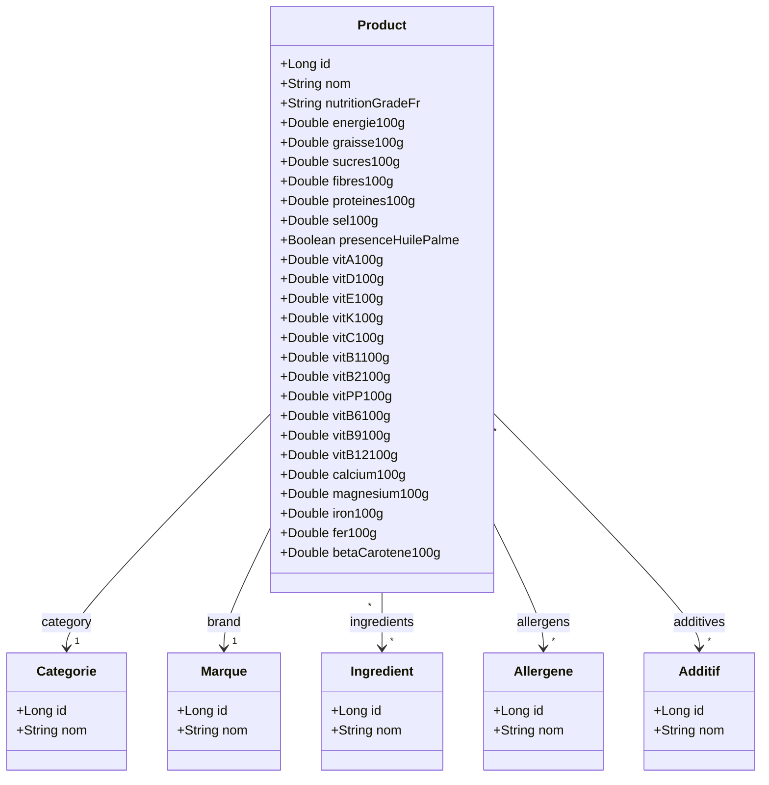
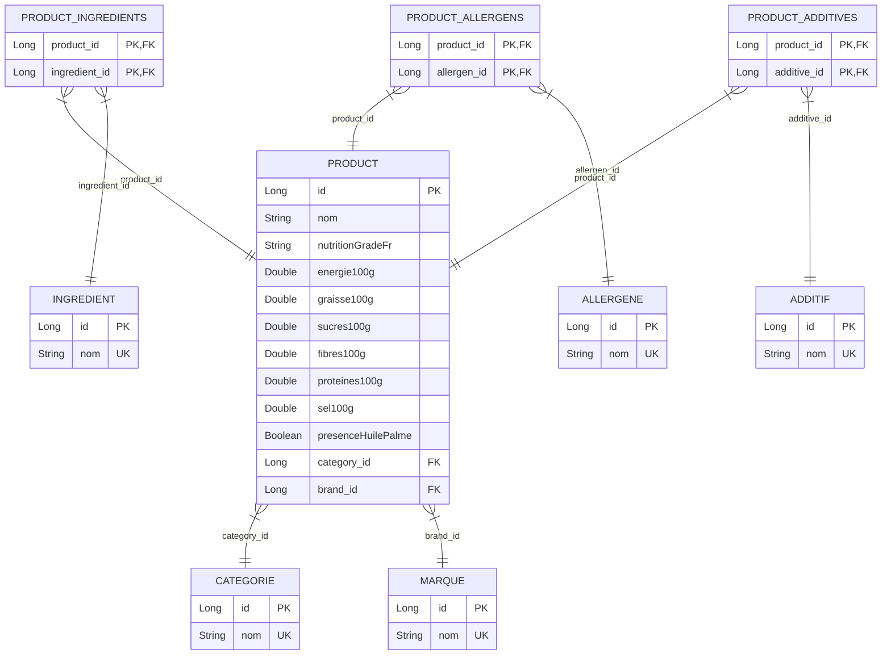

# Conception du projet etl-off

Ce dossier contient les éléments de conception du projet, notamment le diagramme de classes métier et le modèle logique/physique de données (MLD).

## Diagramme de Classes Métier (UML)

## Modèle Physique de Données (MLD)

